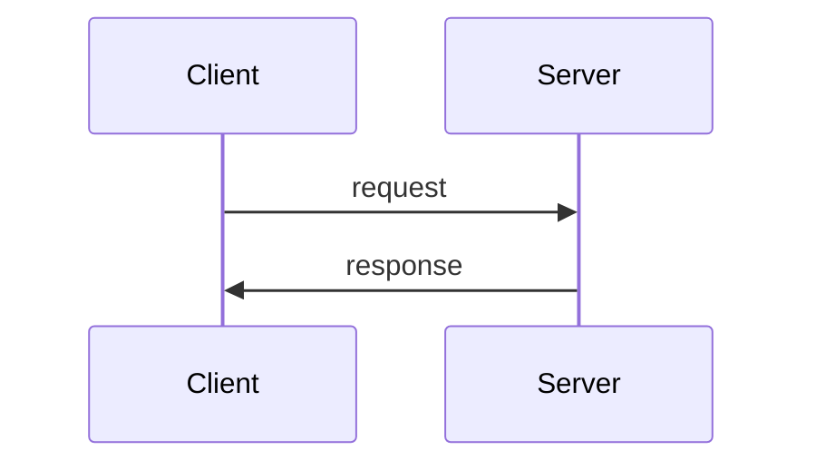

# Lecture 2: Infrastructure: RPC and threads

From [Lecture Notes](https://pdos.csail.mit.edu/6.824/notes/l-rpc.txt), [YT Video](https://www.youtube.com/watch?v=gA4YXUJX7t8)

### Why Go?
*  good support for threads / locking / synchronization
* convenient RPC package
* type safe + memory safe
* garbage-collected (no use after freeing problems)
* threads + GC is particularly attractive!
* relatively simple (compared to C++)
* After the tutorial, use https://golang.org/doc/effective_go.html

### Threads
* main tool for managing concurrency
* a useful structuring tool, but can be tricky
* Go calls them goroutines; everyone else calls them threads

#### Thread = "thread of execution"
- threads allow one program to do many things at once
- one program / one address space
- each thread executes serially, just like an ordinary non-threaded program
	- one PC, one set of registers, one stack
- all threads share memory but have a separate stack (in a single address space)
- each thread includes some per-thread state:
   - program counter, registers, stack

### Why threads?
- They express concurrency, which you need in distributed systems
- I/O concurrency (more efficient)
    - Client sends requests to many servers in parallel and waits for replies (thread per req model)
    - Server processes multiple client requests; each request may block
    - While waiting for the disk to read data for client X, process a request from client Y
- Parallelism (thruput)
   - Execute code in parallel on several cores
   - Share cores across compute heavy jobs on a machine
   - Think bitcoin mining
- Convenience (polling)
   - In background, once per second, check whether each worker is still alive.

### Alternative to threads?
 - Event driven programming (control flow?)
 - write code that explicitly interleaves activities, in a single thread
 - Keep a table of state about each activity, e.g. each client request
 - One "event" loop that:
 - checks for new input for each activity (e.g. arrival of reply from server),
 - does the next step for each activity
 - updates state
 - Event-driven gets you I/O concurrency,
 - and eliminates thread costs (which can be substantial),
 - but doesn't get multi-core speedup
 - much harder to write
 - doesn't help with parallelism 
 - cheaper than using threads
    
### Threading challenges:
 -  shared data between threads is challenging (race conditions)
    - e.g. what if two threads do n = n + 1 at the same time?
    - or one thread reads while another increments?
 - even machine instructions are not atomic
 - this is a "race" -- and is usually a bug
   - `use locks (Go's sync.Mutex)`
      - makes the code within the lock atomic
   - or avoid sharing mutable data
 - coordination between threads (e.g. one thread is producing data, another thread is consuming it)
    - how can the consumer wait (and release the CPU)?
    - how can the producer wake up the consumer?
    - `use Go channels or sync.Cond or WaitGroup`
  - Deadlock
    - cycles via locks and/or communication (e.g. RPC or Go channels)

## Tutorial's web crawler - threading example

### What is a web crawler?
-  goal is to fetch all web pages, e.g. to feed to an indexer
-  web pages and links form a graph
-  multiple links to some pages
-  graph has cycles

### Crawler challenges
- Exploit I/O concurrency
   - Network latency is more limiting than network capacity
   - Fetch many URLs at the same time
   - To increase URLs fetched per second
   - `Need threads for concurrency`
 - Fetch each URL only *once*
   - avoid wasting network bandwidth
   - be nice to remote servers
   - need to remember which URLs visited 
   - know when finished
 - Finding a tree from the cycles

### Two solutions [crawler.go on schedule page]
 1. Serial crawler:
- performs depth-first exploration via recursive Serial calls
- the "fetched" map avoids repeats, breaks cycles
   - a single map, passed by reference, caller sees callee's updates
- but: fetches only one page at a time
   - can we just put a "go" in front of the Serial() call?
   - let's try it... what happened?

2. ConcurrentMutex crawler:
- Creates a thread for each page fetch
   - Many concurrent fetches, higher fetch rate
- the "go func" creates a goroutine and starts it running
   - func... is an "anonymous function"
- the threads share the "fetched" map
   - So only one thread will fetch any given page
 - Why the Mutex (Lock() and Unlock())?
     - One reason:
       - Two different web pages contain links to the same URL
       - Two threads simultaneously fetch those two pages
       - T1 reads fetched[url], T2 reads fetched[url]
       - Both see that url hasn't been fetched (already == false)
       - Both fetch, which is wrong
       - The lock causes the check and update to be atomic
       - So only one thread sees already==false
   - Another reason:
      - Internally, map is a complex data structure (tree? expandable hash?)
      - Concurrent update/update may wreck internal invariants
      - Concurrent update/read may crash the read
   - What if I comment out Lock() / Unlock()?
      - `go run crawler.go` 
        - Why does it work?
      - `go run -race crawler.go`
        - Detects races even when output is correct!
 - How does the ConcurrentMutex crawler decide it is done?
    - sync.WaitGroup
  - Wait() waits for all Add()s to be balanced by Done()s
     - i.e. waits for all child threads to finish
     - [diagram: tree of goroutines, overlaid on cyclic URL graph]
    - there's a WaitGroup per node in the tree
  - How many concurrent threads might this crawler create?
	  - a lot (as many as the webpages)
	  - could be fixed by a threadpool 

3. ConcurrentChannel crawler
-  Go channel:
    - a channel is an object
      `ch := make(chan int)`
    - a channel lets one thread send an object to another thread
    ch <- x
      the sender waits until some goroutine receives
    y := <- ch
      for y := range ch
      a receiver waits until some goroutine sends
  - channels both communicate and synchronize
  - several threads can send and receive on a channel
  - channels are cheap
  - remember: sender blocks until the receiver receives!
      "synchronous"
      watch out for deadlock
  - ConcurrentChannel master()
    master() creates a worker goroutine to fetch each page
    worker() sends slice of page's URLs on a channel
      multiple workers send on the single channel
    master() reads URL slices from the channel
  At what line does the master wait?
    Does the master use CPU time while it waits?
  No need to lock the fetched map, because it isn't shared!
  How does the master know it is done?
    Keeps count of workers in n.
    Each worker sends exactly one item on channel.

Why is it not a race that multiple threads use the same channel?

Is there a race when worker thread writes into a slice of URLs,
  and master thread reads that slice, without locking?
  * worker only writes slice *before* sending
  * master only reads slice *after* receiving
  So they can't use the slice at the same time.

When to use sharing and locks, versus channels?
  Most problems can be solved in either style
  What makes the most sense depends on how the programmer thinks
    state -- sharing and locks
    communication -- channels
  For the 6.824 labs, I recommend sharing+locks for state,
    and sync.Cond or channels or time.Sleep() for waiting/notification.

### Remote Procedure Call (RPC)
  - a key piece of distributed system machinery; all the labs use RPC
  - goal: easy-to-program client/server communication
  - hide details of network protocols
  - convert data (strings, arrays, maps, &c) to "wire format"

#### RPC message diagram

#### Software structure
  client app        handler fns
   stub fns         dispatcher
   RPC lib           RPC lib
     net  ------------ net

#### Go example: kv.go on schedule page
  A toy key/value storage server -- Put(key,value), Get(key)->value
  Uses Go's RPC library
  Common:
    Declare Args and Reply struct for each server handler.
  Client:
    connect()'s Dial() creates a TCP connection to the server
    get() and put() are client "stubs"
    Call() asks the RPC library to perform the call
      you specify server function name, arguments, place to put reply
      library marshalls args, sends request, waits, unmarshalls reply
      return value from Call() indicates whether it got a reply
      usually you'll also have a reply.Err indicating service-level failure
  Server:
    Go requires server to declare an object with methods as RPC handlers
    Server then registers that object with the RPC library
    Server accepts TCP connections, gives them to RPC library
    The RPC library
      reads each request
      creates a new goroutine for this request
      unmarshalls request
      looks up the named object (in table create by Register())
      calls the object's named method (dispatch)
      marshalls reply
      writes reply on TCP connection
    The server's Get() and Put() handlers
      Must lock, since RPC library creates a new goroutine for each request
      read args; modify reply
 
A few details:
  Binding: how does client know what server computer to talk to?
    For Go's RPC, server name/port is an argument to Dial
    Big systems have some kind of name or configuration server
  Marshalling: format data into packets
    Go's RPC library can pass strings, arrays, objects, maps, &c
    Go passes pointers by copying the pointed-to data
    Cannot pass channels or functions

RPC problem: what to do about failures?
  e.g. lost packet, broken network, slow server, crashed server

What does a failure look like to the client RPC library?
  Client never sees a response from the server
  Client does *not* know if the server saw the request!
    [diagram of losses at various points]
    Maybe server never saw the request
    Maybe server executed, crashed just before sending reply
    Maybe server executed, but network died just before delivering reply

Simplest failure-handling scheme: "best effort"
  Call() waits for response for a while
  If none arrives, re-send the request
  Do this a few times
  Then give up and return an error

Q: is "best effort" easy for applications to cope with?

A particularly bad situation:
  client executes
    Put("k", 10);
    Put("k", 20);
  both succeed
  what will Get("k") yield?
  [diagram, timeout, re-send, original arrives late]

Q: is best effort ever OK?
   read-only operations
   operations that do nothing if repeated
     e.g. DB checks if record has already been inserted

Better RPC behavior: "at most once"
  idea: server RPC code detects duplicate requests
    returns previous reply instead of re-running handler
  Q: how to detect a duplicate request?
  client includes unique ID (XID) with each request
    uses same XID for re-send
  server:
    if seen[xid]:
      r = old[xid]
    else
      r = handler()
      old[xid] = r
      seen[xid] = true

some at-most-once complexities
  this will come up in lab 3
  what if two clients use the same XID?
    big random number?
    combine unique client ID (ip address?) with sequence #?
  server must eventually discard info about old RPCs
    when is discard safe?
    idea:
      each client has a unique ID (perhaps a big random number)
      per-client RPC sequence numbers
      client includes "seen all replies <= X" with every RPC
      much like TCP sequence #s and acks
    or only allow client one outstanding RPC at a time
      arrival of seq+1 allows server to discard all <= seq
  how to handle dup req while original is still executing?
    server doesn't know reply yet
    idea: "pending" flag per executing RPC; wait or ignore

What if an at-most-once server crashes and re-starts?
  if at-most-once duplicate info in memory, server will forget
    and accept duplicate requests after re-start
  maybe it should write the duplicate info to disk
  maybe replica server should also replicate duplicate info

Go RPC is a simple form of "at-most-once"
  open TCP connection
  write request to TCP connection
  Go RPC never re-sends a request
    So server won't see duplicate requests
  Go RPC code returns an error if it doesn't get a reply
    perhaps after a timeout (from TCP)
    perhaps server didn't see request
    perhaps server processed request but server/net failed before reply came back

What about "exactly once"?
  unbounded retries plus duplicate detection plus fault-tolerant service
  Lab 3

> Written with [StackEdit](https://stackedit.io/).
<!--stackedit_data:
eyJwcm9wZXJ0aWVzIjoidGl0bGU6IE1JVCAtIExlYyAyXG4iLC
JoaXN0b3J5IjpbLTYyNjc2MDg5M119
-->