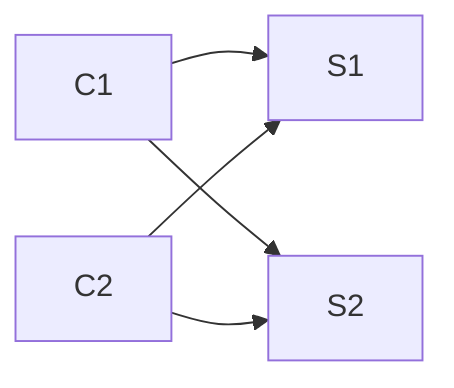
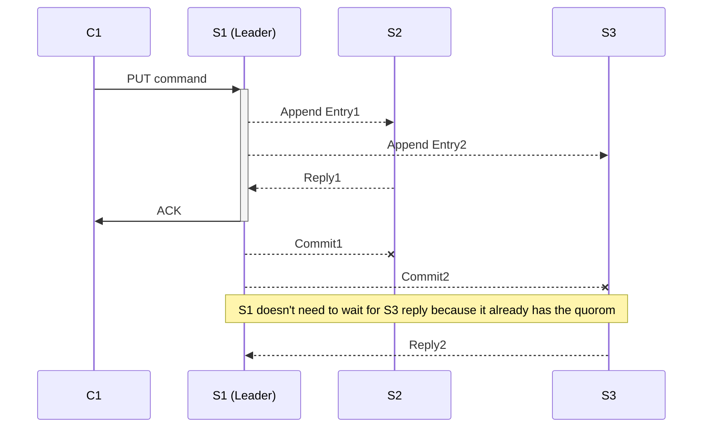

# Lecture 6: Raft (1)

## Raft elections and log handling

- A pattern in the fault-tolerant systems pattern
  * MR replicates computation but relies on a single master to organize
  * GFS replicates data but relies on the master to pick primaries
  * VMware FT replicates service but relies on test-and-set to pick primary
 - In all cases - call rely on a single entity to make critical decisions
    - pro: decisions by a single entity avoid split brain

### Split brain situation - and why is it damaging?
 - suppose we're replicating a **test-and-set**  service
    - the client request sets the state to 1, server replies w/ previous state
    -  only one client should get a reply with "0"
 - it's a lock, only one requester should get it


 
- Suppose client C1 can contact replica S1, but not replica S2. Should C1 proceed with just replica S1?
 ```mermaid
graph LR
C1 --> S1
C1 -.broken.-> S2 
C2 --> S1 
C2 --> S2
```

1.  if C1 needs to talk to both S1 and S2
	- situation is worse from a fault tolerant POV
	- more likely to fail given both servers need to be up  
2. if it is ok for C1 to talk to either S1 or S2
	- not ok, because the other one is alive and has another state (and talking to other clients)
	- split brain situation 
	

- if S2 has really crashed, C1 *must* proceed without S2,
   - otherwise the service doesn't tolerate faults!
- if S2 is up but network prevents C1 from contacting S2,
   - C1 should *not* proceed without S2,
   - since S2 might be alive and serving client C2
 
 With this setup, we're faced with a nasty choice:
    - either no ability to tolerate faults, despite replication, or
    - the possibility of incorrect operation due to split brain

### Problem: computers cannot distinguish "server crashed" vs "network broken"
- the symptom is the same: no response to a query over the network
  the bad situation is often called "network partition":
   - C1 can talk to S1, C2 can talk to S2,
   - but C1+S1 see no responses from C2+S2
 - this difficulty seemed insurmountable for a long time
 - seemed to require outside agent (a human) to decide when to cut over
    - or a single perfectly reliable server (FT's test-and-set server)
    - or a perfectly reliable network (so "no response" == "crashed")
 - BUT these are all single points of failure -- not desirable
	  - can one do better?

### Majority Vote
 - require an odd number of servers, e.g. 3
 - agreement from a majority is required to do anything -- 2 out of 3
 - why does majority help avoid split brain?
    - at most one partition can have a majority
    - breaks the symmetry we saw with just two servers
 - note: majority is out of all servers, not just out of live ones
 - more generally 2f+1 can tolerate f failed servers
    - since the remaining f+1 is a majority of 2f+1
    - if more than f fail (or can't be contacted), no progress
- often called **quorum** systems

#### Majority - why it matters?
- a key property of majorities is that any two (majorities) must intersect
  - e.g. successive majorities for Raft leader election must overlap
  - and the intersection can convey information about previous decisions

### Two partition-tolerant replication schemes 
- invented around 1990,
- Paxos and View-Stamped Replication
- in the last 15 years this technology has seen a lot of real-world use
- the Raft paper is a good introduction to modern techniques

## Raft overview
[https://raft.github.io/raft.pdf](https://raft.github.io/raft.pdf)
[https://raft.github.io/](https://raft.github.io/)
[https://en.wikipedia.org/wiki/Raft_(computer_science)](https://en.wikipedia.org/wiki/Raft_(computer_science))
[https://github.com/ankush-phulia/Distributed-Systems/tree/master/Assignment%203%20-%20RAFT](https://github.com/ankush-phulia/Distributed-Systems/tree/master/Assignment%203%20-%20RAFT)


### State machine replication with Raft
- Raft is a library included in each replica

- Diagram
	 - clients
	 - 3 replicas
	 - kv layer + state 
	 - raft layer + logs

- clients are not aware of replication in raft
- makes put/get request

### Timing diagram of a command



- client sends Put/Get "command" to k/v layer in leader
- raft leader adds command to log
- leader sends AppendEntries RPCs to followers
- followers add command to log
- leader waits for replies from a bare majority (including itself)
- entry is **committed** if a majority put it in their logs
   - committed means won't be forgotten even if failures
   - majority -> will be seen by the next leader's vote requests
- leader executes command, replies to client
- leader "piggybacks" commit info in next AppendEntries
- followers execute entry once leader says it's committed

### why the logs?
-  the service keeps the state machine state, e.g. key/value DB
   - why isn't that enough?
 - the log **orders**    the commands
    - to help replicas agree on a single execution order
    - to help the leader ensure followers have identical logs
 - the log stores tentative commands until committed
 - the log stores commands in case leader must re-send to followers
 - the log stores commands persistently for replay after reboot

### Are the servers' logs exact replicas?
 - no: some replicas may lag
 - no: we'll see that they can temporarily have different entries
 - the good news:
    - they'll **eventually converge** to be identical
    - the commit mechanism ensures servers only execute stable entries
  
### lab 2 Raft interface
  rf.Start(command) (index, term, isleader)
    Lab 3 k/v server's Put()/Get() RPC handlers call Start()
    Start() only makes sense on the leader
    starts Raft agreement on a new log entry
      add to leader's log
      leader sends out AppendEntries RPCs
      Start() returns w/o waiting for RPC replies
      k/v layer's Put()/Get() must wait for commit, on applyCh
    agreement might fail if server loses leadership before committing 
      then the command is likely lost, client must re-send
    isleader: false if this server isn't the leader, client should try another
    term: currentTerm, to help caller detect if leader is later demoted
    index: log entry to watch to see if the command was committed
  ApplyMsg, with Index and Command
    each peer sends an ApplyMsg on applyCh for each committed entry
    each peer's local service code executes, updates local replica state
    leader sends reply to waiting client RPC

### two main parts to Raft's design:
 1. electing a new leader
 2. ensuring identical logs despite failures

## Leader election (Lab 2A)

### why a leader?
  - ensures all replicas execute the same commands, in the same order
  - (some designs, e.g. original Paxos, don't have a leader)

### Raft numbers the sequence of leaders
 - new leader -> new term
 - a term has at most one leader; might have no leader
 - the numbering helps servers follow latest leader, not superseded leader

when does a Raft peer start a leader election?
  when it doesn't hear from current leader for an "election timeout"
  increments local currentTerm, tries to collect votes
  note: this can lead to un-needed elections; that's slow but safe
  note: old leader may still be alive and think it is the leader

how to ensure at most one leader in a term?
  (Figure 2 RequestVote RPC and Rules for Servers)
  leader must get "yes" votes from a majority of servers
  each server can cast only one vote per term
    if candidate, votes for itself
    if not a candidate, votes for first that asks (within Figure 2 rules)
  at most one server can get majority of votes for a given term
    -> at most one leader even if network partition
    -> election can succeed even if some servers have failed

how does a server learn about newly elected leader?
  new leader sees yes votes from majority
  others see AppendEntries heart-beats with a higher term number
    i.e. from the new leader
  the heart-beats suppress any new election

an election may not succeed for two reasons:
  * less than a majority of servers are reachable
  * simultaneous candidates split the vote, none gets majority

what happens if an election doesn't succeed?
  another timeout (no heartbeat), a new election (and new term)
  higher term takes precedence, candidates for older terms quit

how does Raft avoid split votes?
  each server picks a random election timeout
  [diagram of times at which servers' timeouts expire]
  randomness breaks symmetry among the servers
    one will choose lowest random delay
  hopefully enough time to elect before next timeout expires
  others will see new leader's AppendEntries heartbeats and 
    not become candidates
  randomized delays are a common pattern in network protocols

how to choose the election timeout?
  * at least a few heartbeat intervals (in case network drops a heartbeat)
    to avoid needless elections, which waste time
  * random part long enough to let one candidate succeed before next starts
  * short enough to react quickly to failure, avoid long pauses
  * short enough to allow a few re-tries before tester gets upset
    tester requires election to complete in 5 seconds or less

what if old leader isn't aware a new leader is elected?
  perhaps old leader didn't see election messages
  perhaps old leader is in a minority network partition
  new leader means a majority of servers have incremented currentTerm
    so old leader (w/ old term) can't get majority for AppendEntries
    so old leader won't commit or execute any new log entries
    thus no split brain
    but a minority may accept old server's AppendEntries
      so logs may diverge at end of old term
      


> Written with [StackEdit](https://stackedit.io/).
<!--stackedit_data:
eyJoaXN0b3J5IjpbMTkyMDEwMjI3OSwtMjExNjQ3NDUyMCwtMT
kyMTk3MDQ5NiwxMTU1MDg2NjkyLDE1NzAzMzM4NjAsLTI4MjU2
MDU2OCwtNjYzOTA2OSw3NzI1MzI0MjMsMzc2MTk4MTAyLC02Nz
U4NDc4OTMsMTI5MDg1MjU0LC00NzY2MzMzNjgsMTc2OTgwNjg3
MSwtNTI1MDU1NTI5LDI2MjUzNDc5OCwtNDU4NzU5MTIyXX0=
-->