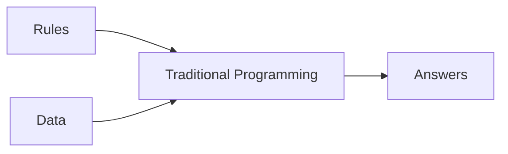
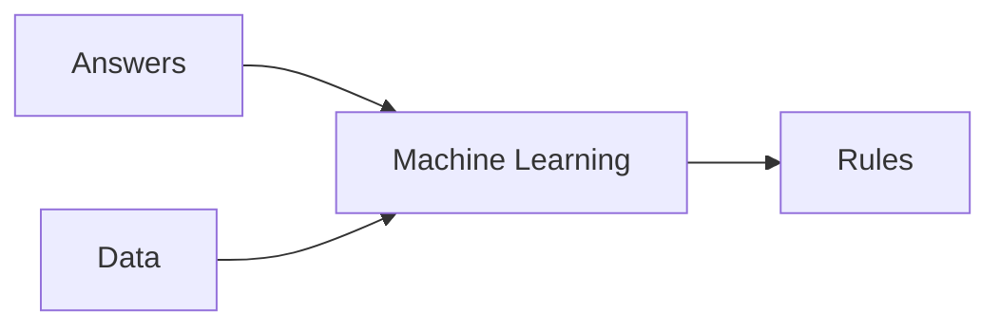

# [Course 1 - Intro to Tensorflow](https://www.coursera.org/learn/introduction-tensorflow/home/welcome)

## [Week 1](https://www.coursera.org/learn/introduction-tensorflow/home/week/1)

### Primer

#### Traditional Programming
- rules based programming
- if-then statements


#### Machine Learning
- lots of examples + label
- rules are inferred by ML

### Hello World - Neural Network
[colab](https://github.com/lmoroney/dlaicourse/blob/master/Course%201%20-%20Part%202%20-%20Lesson%202%20-%20Notebook.ipynb)

> X = 
> Y = 
Simple linear curve fitting  

> keras.Sequential()
Define successive layers

> keras.layers.Dense()
Define a layer of connected neurons 
this could be done as a list of Dense() inside Sequential() or Sequential.add(Dense())

> model.compile(optimizer='sgd', loss='mean_squared_error')
define the loss function, and optimizer - to guess the next value (for gradient descent)

> model.fit(epochs=N)
actual training of the model

> model.predict([input])
inference / find predicted values

> model.evaluate(test_images, test_labels)
evaluate the test set


## [Week 2](https://www.coursera.org/learn/introduction-tensorflow/home/week/2)

[colab](https://github.com/lmoroney/dlaicourse/blob/master/Course%201%20-%20Part%204%20-%20Lesson%202%20-%20Notebook.ipynb)

### Intro to Computer Vision
- Help computers look at the images (and understand the content)
- [Fashion MNIST](https://github.com/zalandoresearch/fashion-mnist) -  78k images, 10 categories, 28x28 pixels each
- keras has in-build [datasets] (https://www.tensorflow.org/api_docs/python/tf/keras/datasets) including fashion MNIST

> fashion_mnist = keras.datasets.fashion_mnist
> (train_images, train_labels), (test_images, test_labels) = fashion_mnist.load_data()

- separated training and test data
- labels are enum (numbers) instead of strings - to reduce language [bias](https://developers.google.com/machine-learning/fairness-overview/)

### Coding a CV Neural Network
> keras.layers.Flatten(input_shape=(28, 28))
Takes the input as a linear array

> keras.layers.Dense(128, activation=tf.nn.relu)
Hidden Layer

 > keras.layers.Dense(128, activation=tf.nn.softmax)
> Output layer

### Callback to terminate the training
```
class myCallback(keras.callbacks.Callback):
def on_epoch_end(self, epoch, logs={}):
    if logs.get('loss') < 0.4:
        self.model.stop_training = True

callbacks = myCallback()
model.fit(..., callbacks=[callbacks])
```
### Colab Exporations
> Simple NN (28x28 Flatten, 128 relu, 10 softmax) - no CNN

[Ex 1](https://colab.research.google.com/github/lmoroney/dlaicourse/blob/master/Course%201%20-%20Part%204%20-%20Lesson%202%20-%20Notebook.ipynb#scrollTo=rquQqIx4AaGR) - What are the numbers?
A - It is the probability that each item is one of the 10 class (and using softmax, we choose the highest probability)

[Ex 2](https://colab.research.google.com/github/lmoroney/dlaicourse/blob/master/Course%201%20-%20Part%204%20-%20Lesson%202%20-%20Notebook.ipynb#scrollTo=OgQSIfDSOWv6) Impact of larger neurons in the hidden layer(512)?
A - More neurons = slower (and more accurate) training; till an extend.

[Ex 5](https://colab.research.google.com/github/lmoroney/dlaicourse/blob/master/Course%201%20-%20Part%204%20-%20Lesson%202%20-%20Notebook.ipynb#scrollTo=-0lF5MuvSuZF) What is the affect of adding additional hidden layer?
A - Usually more helpful but in this particular case, adding an additional layer reduced the accuracy.

## [Week 3](https://www.coursera.org/learn/introduction-tensorflow/home/week/3)

[colab](https://colab.sandbox.google.com/github/lmoroney/dlaicourse/blob/master/Course%201%20-%20Part%206%20-%20Lesson%202%20-%20Notebook.ipynb)

### CNN - Convolutions and Pooling
- Convolutions are like filters to extract features from images
- Pooling is compressing the result of convolution while reducing the image dimension

> training_images=training_images.reshape(60000, 28, 28, 1)
reshape the input

> tf.keras.layers.Conv2D(num_conv, (3, 3), activation='relu', input_shape=(28, 28, 1))
> tk.keras.layers.MaxPooling2D(2, 2)
Stack the Conv2D and MaxPooling2D before the regular NN layers.

> model.summary()
Shows the NN
the size of image is smaller in the layers because of conv-layers window

[Examples of filters](https://lodev.org/cgtutor/filtering.html)

 ### Colab Exporations
> CNN = Conv(64 x (3,3)), MP(2,2), Conv(64 x (3,3)), MP(2,2),  Flatten, Dense(128) + relu, Dense(10) + softmax
Ex 1 - More training might lead to smaller loss with training set but not with validation set (overfitting).

## [Week 4](https://www.coursera.org/learn/introduction-tensorflow/home/week/4)

### Colabs
- [No Validation](https://github.com/lmoroney/dlaicourse/blob/master/Course%201%20-%20Part%208%20-%20Lesson%202%20-%20Notebook.ipynb)
- [With Validation](https://github.com/lmoroney/dlaicourse/blob/master/Course%201%20-%20Part%208%20-%20Lesson%203%20-%20Notebook.ipynb)
- [Reduced complexity](https://github.com/lmoroney/dlaicourse/blob/master/Course%201%20-%20Part%208%20-%20Lesson%204%20-%20Notebook.ipynb)

### Non-uniform/complex images
- different location of subject in the image
- much cleaner data

### ImageGenerator in TF
- Uses the directory structure to pick up labels
- images need to be of same size (for the TF code) 
- resized when they are loaded (done by ImageGenerator)

### Convnet Code
- 5 layers of CNN 16 -> 32 -> 64 ->64 -> 64
- 3 channels in inputs (RGB)
- Output is single-neuron with sigmoid
	- could have used 2 neurons with softmax
- batch_size : to handle multiple input images together
- steps_per_epoch : number of steps to train in an epoch
	- save value is num_images / 

> model.compile(loss='binary_crossentropy',
- because we are using binary classifier
> optimizer =RMSProp(lr=0.001)
- to specify learning rate


> train_datagen = ImageDataGenerator(rescale=1/255)
> train_generator = train_datagen.flow_from_directory('/tmp/horse-or-human/', 
> #This is the source directory for training images
> target_size=(300, 300), # All images will be resized to 150x150
> batch_size=128, 
> #Since we use binary_crossentropy loss, we need binary labels
> class_mode='binary')

> model.fit_generator(train_generator, 
> steps_per_epoch=8,
> epocs=15,
> validation_data=validation_generator,
> validation_steps=8,
> verbose=2)

### to speed up (at cost of accuracy)
- reduce image size
- change number of CNN layers


<!--stackedit_data:
eyJoaXN0b3J5IjpbMTQzODAwMzg4MCwtMTk1NTY0NjkzMyw5Nz
cxMDYwNTUsMTI2OTU0NTc2OSwxMjg3NDU1NjQsLTEzNzUwMzIx
MTIsMTEyNDA0NDA3MSwtMTQxMTI4ODA1NSw5MzE4MTQwNSwyMD
E1NTE0OTQwLDEyNTEyMjc3NDQsLTY1MTIzMzYzLDEyNDA1NTE1
NywtNTAxMTE2MDgsLTU5MDI4ODg0MSwyNDQzMjE3NDYsLTExMz
E2NDE5ODQsODIyODkyNTMwLC01NTcyNTkwNzMsNzk2OTYxNTIy
XX0=
-->