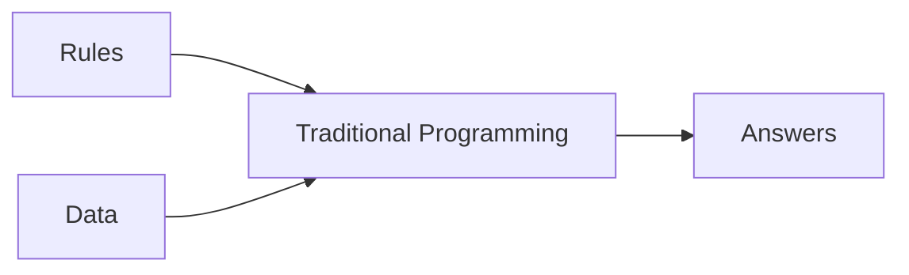
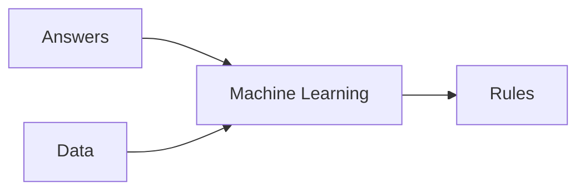

# [Course 1 - Intro to Tensorflow](https://www.coursera.org/learn/introduction-tensorflow/home/welcome)

## [Week 1](https://www.coursera.org/learn/introduction-tensorflow/home/week/1)

### Primer

#### Traditional Programming
- rules based programming
- if-then statements

#### Machine Learning
- lots of examples + label
- rules are inferred by ML

### [Hello World on Neural Network](https://github.com/lmoroney/dlaicourse/blob/master/Course%201%20-%20Part%202%20-%20Lesson%202%20-%20Notebook.ipynb)
> X = 
> Y = 
Simple linear curve fitting  

> keras.layers.Dense()
Define a layer of connected neurons

> keras.Sequential()
Define successive layers

> model.compile(optimizer='sgd', loss='mean_squared_error')
define the loss function, and optimizer - to guess the next value (for gradient descent)

> model.fit(epochs=N)
actual training of the model

> model.predict([input])
inference / find predicted values

## [Week 2](https://www.coursera.org/learn/introduction-tensorflow/home/week/2)

[]
(https://github.com/lmoroney/dlaicourse/blob/master/Course%201%20-%20Part%204%20-%20Lesson%202%20-%20Notebook.ipynb)

### Intro to Computer Vision
- Help computers look at the images (and understand the content)
- [Fashion MNIST](https://github.com/zalandoresearch/fashion-mnist) -  78k images, 10 categories, 28x28 pixels each
- keras has in-build datasets
 
<!--stackedit_data:
eyJoaXN0b3J5IjpbLTIwNTQ2NTk3MjksLTExOTYyNzM2NTUsNT
Q1Mjk2NTk4LC02NTU5OTM2MDYsLTIxMDMxMjEyOTAsLTExMTQ2
ODU0MDcsLTkwNTU0ODgyNyw3MzA5OTgxMTZdfQ==
-->