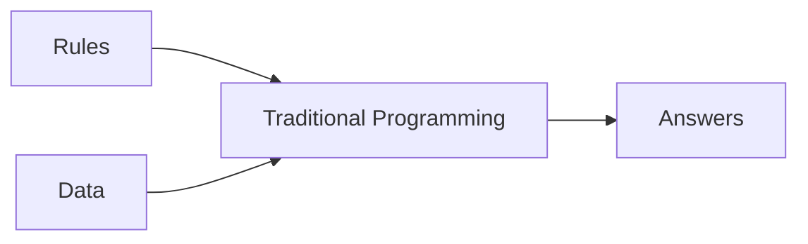
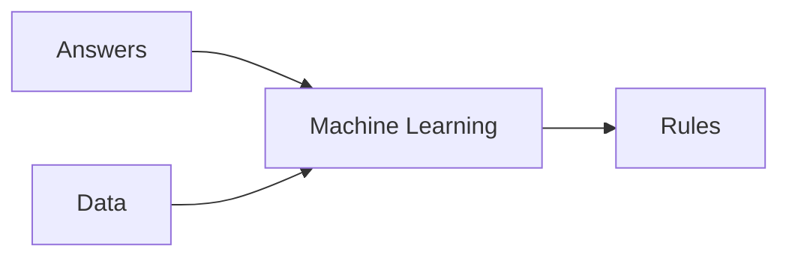

# [Course 1 - Intro to Tensorflow](https://www.coursera.org/learn/introduction-tensorflow/home/welcome)

## [Week 1](https://www.coursera.org/learn/introduction-tensorflow/home/week/1)

### Primer

#### Traditional Programming
- rules based programming
- if-then statements


#### Machine Learning
- lots of examples + label
- rules are inferred by ML

### Hello World - Neural Network
[colab](https://github.com/lmoroney/dlaicourse/blob/master/Course%201%20-%20Part%202%20-%20Lesson%202%20-%20Notebook.ipynb)

> X = 
> Y = 
Simple linear curve fitting  

> keras.layers.Dense()
Define a layer of connected neurons

> keras.Sequential()
Define successive layers

> model.compile(optimizer='sgd', loss='mean_squared_error')
define the loss function, and optimizer - to guess the next value (for gradient descent)

> model.fit(epochs=N)
actual training of the model

> model.predict([input])
inference / find predicted values


## [Week 2](https://www.coursera.org/learn/introduction-tensorflow/home/week/2)

[colab](https://github.com/lmoroney/dlaicourse/blob/master/Course%201%20-%20Part%204%20-%20Lesson%202%20-%20Notebook.ipynb)

### Intro to Computer Vision
- Help computers look at the images (and understand the content)
- [Fashion MNIST](https://github.com/zalandoresearch/fashion-mnist) -  78k images, 10 categories, 28x28 pixels each
- keras has in-build [datasets] (https://www.tensorflow.org/api_docs/python/tf/keras/datasets) including fashion MNIST

> fashion_mnist = keras.datasets.fashion_mnist
> (train_images, train_labels), (test_images, test_labels) = fashion_mnist.load_data()

- separated training and test data
- labels are enum (numbers) instead of strings - to reduce language [bias](https://developers.google.com/machine-learning/fairness-overview/)

### Coding a CV Neural Network
> keras.layers.Flatten(input_shape=(28, 28))
Takes the input as a linear array

> keras.layers.Dense(128, activation=tf.nn.relu)
Hidden Layer

 > keras.layers.Dense(128, activation=tf.nn.softmax)
> Output layer

### Callback to terminate the training
```
class myCallback(keras.callbacks.Callback):
def on_epoch_end(self, epoch, logs={}):
    if logs.get('loss') < 0.4:
        self.model.stop_training = True

callbacks = myCallback()
model.fit(..., callbacks=[callbacks])
```

## [Week 3](https://www.coursera.org/learn/introduction-tensorflow/home/week/3)

[colab](https://colab.sandbox.google.com/github/lmoroney/dlaicourse/blob/master/Course%201%20-%20Part%206%20-%20Lesson%202%20-%20Notebook.ipynb)

### CNN - Convolutions and Pooling
- Convolutions are like filters to extract features from images
- Pooling is merging the result of convolution while reducing the image dimention

> tf.keras.layers.Conv2D(num_conv, (3, 3), activation='relu', input_shape=(28, 28, 1))
> tk.keras.layers.MaxPooling2D(2, 2)
Stack the Conv2D and MaxPooling2D before the regular NN layers.

> model.summary()
Shows the NN
the size is smaller because of conv-layers


<!--stackedit_data:
eyJoaXN0b3J5IjpbNzIwMTMzNTUwLDM1ODE4Mzc2OCwtMTg1ND
Y1MzQ3MSwxNzM1MDE2ODAzLDY5MjMyNDA0NCwxNTczNjE2NzQs
MjEyNTUzODE5NiwxNTgyMzUwMDU0LC0xMTk2MjczNjU1LDU0NT
I5NjU5OCwtNjU1OTkzNjA2LC0yMTAzMTIxMjkwLC0xMTE0Njg1
NDA3LC05MDU1NDg4MjcsNzMwOTk4MTE2XX0=
-->