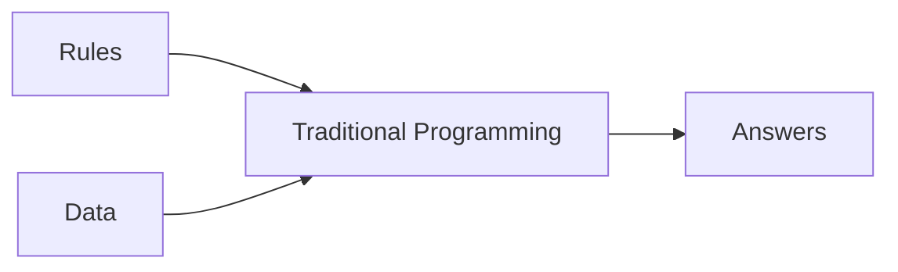
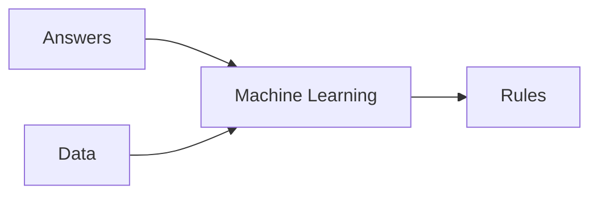

# [Specialization - Tensorflow in Practice](https://www.coursera.org/specializations/tensorflow-in-practice)

# [Course 1 - Intro to Tensorflow](https://www.coursera.org/learn/introduction-tensorflow/home/welcome)

## [Week 1](https://www.coursera.org/learn/introduction-tensorflow/home/week/1)

### Primer

#### Traditional Programming
- rules based programming
- if-then statements


#### Machine Learning
- lots of examples + label
- rules are inferred by ML

### Hello World - Neural Network
[colab](https://github.com/lmoroney/dlaicourse/blob/master/Course%201%20-%20Part%202%20-%20Lesson%202%20-%20Notebook.ipynb)

> X = 
> Y = 
Simple linear curve fitting  

> keras.Sequential()
Define successive layers

> keras.layers.Dense()
Define a layer of connected neurons 
this could be done as a list of Dense() inside Sequential() or Sequential.add(Dense())

> model.compile(optimizer='sgd', loss='mean_squared_error')
define the loss function, and optimizer - to guess the next value (for gradient descent)

> model.fit(epochs=N)
actual training of the model

> model.predict([input])
inference / find predicted values

> model.evaluate(test_images, test_labels)
evaluate the test set


## [Week 2](https://www.coursera.org/learn/introduction-tensorflow/home/week/2)

[colab](https://github.com/lmoroney/dlaicourse/blob/master/Course%201%20-%20Part%204%20-%20Lesson%202%20-%20Notebook.ipynb)

### Intro to Computer Vision
- Help computers look at the images (and understand the content)
- [Fashion MNIST](https://github.com/zalandoresearch/fashion-mnist) -  78k images, 10 categories, 28x28 pixels each
- keras has in-build [datasets] (https://www.tensorflow.org/api_docs/python/tf/keras/datasets) including fashion MNIST

> fashion_mnist = keras.datasets.fashion_mnist
> (train_images, train_labels), (test_images, test_labels) = fashion_mnist.load_data()

- separated training and test data
- labels are enum (numbers) instead of strings - to reduce language [bias](https://developers.google.com/machine-learning/fairness-overview/)

### Coding a CV Neural Network
> keras.layers.Flatten(input_shape=(28, 28))
Takes the input as a linear array

> keras.layers.Dense(128, activation=tf.nn.relu)
Hidden Layer

 > keras.layers.Dense(128, activation=tf.nn.softmax)
> Output layer

### Callback to terminate the training
```
class myCallback(keras.callbacks.Callback):
def on_epoch_end(self, epoch, logs={}):
    if logs.get('accuracy') > DESIRED_ACCURACY:
    print(f"\nReached {DESIRED_ACCURACY}% accuracy so cancelling training!")
        self.model.stop_training = True

callbacks = myCallback()
model.fit(..., callbacks=[callbacks])
```
### Colab Exporations
> Simple NN (28x28 Flatten, 128 relu, 10 softmax) - no CNN

[Ex 1](https://colab.research.google.com/github/lmoroney/dlaicourse/blob/master/Course%201%20-%20Part%204%20-%20Lesson%202%20-%20Notebook.ipynb#scrollTo=rquQqIx4AaGR) - What are the numbers?
A - It is the probability that each item is one of the 10 class (and using softmax, we choose the highest probability)

[Ex 2](https://colab.research.google.com/github/lmoroney/dlaicourse/blob/master/Course%201%20-%20Part%204%20-%20Lesson%202%20-%20Notebook.ipynb#scrollTo=OgQSIfDSOWv6) Impact of larger neurons in the hidden layer(512)?
A - More neurons = slower (and more accurate) training; till an extend.

[Ex 5](https://colab.research.google.com/github/lmoroney/dlaicourse/blob/master/Course%201%20-%20Part%204%20-%20Lesson%202%20-%20Notebook.ipynb#scrollTo=-0lF5MuvSuZF) What is the affect of adding additional hidden layer?
A - Usually more helpful but in this particular case, adding an additional layer reduced the accuracy.

## [Week 3](https://www.coursera.org/learn/introduction-tensorflow/home/week/3)

[colab](https://colab.sandbox.google.com/github/lmoroney/dlaicourse/blob/master/Course%201%20-%20Part%206%20-%20Lesson%202%20-%20Notebook.ipynb)

### CNN - Convolutions and Pooling
- Convolutions are like filters to extract features from images
- Pooling is compressing the result of convolution while reducing the image dimension

> training_images=training_images.reshape(60000, 28, 28, 1)
reshape the input

> tf.keras.layers.Conv2D(num_conv, (3, 3), activation='relu', input_shape=(28, 28, 1))
> tk.keras.layers.MaxPooling2D(2, 2)
Stack the Conv2D and MaxPooling2D before the regular NN layers.

> model.summary()
Shows the NN
the size of image is smaller in the layers because of conv-layers window

[Examples of filters](https://lodev.org/cgtutor/filtering.html)

 ### Colab Exporations
> CNN = Conv(64 x (3,3)), MP(2,2), Conv(64 x (3,3)), MP(2,2),  Flatten, Dense(128) + relu, Dense(10) + softmax
Ex 1 - More training might lead to smaller loss with training set but not with validation set (overfitting).

## [Week 4](https://www.coursera.org/learn/introduction-tensorflow/home/week/4)

### Colabs
- [No Validation](https://github.com/lmoroney/dlaicourse/blob/master/Course%201%20-%20Part%208%20-%20Lesson%202%20-%20Notebook.ipynb)
- [With Validation](https://github.com/lmoroney/dlaicourse/blob/master/Course%201%20-%20Part%208%20-%20Lesson%203%20-%20Notebook.ipynb)
- [Reduced complexity](https://github.com/lmoroney/dlaicourse/blob/master/Course%201%20-%20Part%208%20-%20Lesson%204%20-%20Notebook.ipynb)

### Non-uniform/complex images
- different location of subject in the image
- much cleaner data

### ImageGenerator in TF
- Uses the directory structure to pick up labels
- images need to be of same size (for the TF code) 
- resized when they are loaded (done by ImageGenerator)

### ConvNet params
- 5 layers of CNN 16 -> 32 -> 64 ->64 -> 64
- 3 channels in inputs (RGB)
- Output is single-neuron with sigmoid
	- could have used 2 neurons with softmax
- batch_size : to handle multiple input images together
- steps_per_epoch : number of steps to train in an epoch
	- save value is num_images / batch_size so that every image is processed once in the epoch

### ConvNet Code

- binary_crossentropy because we are using a binary classifier
- RMSProp to specify learning rate
```
from tensorflow.keras.optimizers import RMSprop
model.compile(loss='binary_crossentropy',
              optimizer=RMSprop(lr=0.001),
              metrics=['accuracy'])
```

```
# All images will be resized to 150x150
train_datagen = ImageDataGenerator(rescale=1/255)
train_generator = train_datagen.flow_from_directory('/tmp/horse-or-human/', 
target_size=(300, 300), 
batch_size=128, 
class_mode='binary')
```

```
model.fit(train_generator, 
steps_per_epoch=8,
epochs=15,
validation_data=validation_generator,
validation_steps=8,
verbose=2)
```

###  Speed up (at cost of accuracy)
- by reducing image size
- changing number of CNN layers

# [Course 2 - CNN in Tensorflow](https://www.coursera.org/learn/convolutional-neural-networks-tensorflow)

## [Week 1](https://www.coursera.org/learn/convolutional-neural-networks-tensorflow/home/week/1)


### Data is coming from real-world
- less cleaner
- the previous structure works well

```
history = model.fit()
acc = history.history[ 'accuracy' ]
val_acc = history.history[ 'val_accuracy' ]
loss = history.history[ 'loss' ]
val_loss = history.history['val_loss' ]
```

## [Week 2 - Image Augmentation](https://www.coursera.org/learn/convolutional-neural-networks-tensorflow/home/week/2)

### Data Augmentation
- No additional storage, all transformation are in memory while reading the data
- Reduce overfitting

```
train_datagen = ImageDataGenerator(      
	rotation_range=40,      
	width_shift_range=0.2,      
	height_shift_range=0.2,      
	shear_range=0.2,      
	zoom_range=0.2,      
	horizontal_flip=True,      
	fill_mode='nearest')
```

From [Tensorboard in notebook](https://www.tensorflow.org/tensorboard/tensorboard_in_notebooks)
```
%load_ext tensorboard
import datetime
logdir = os.path.join("logs", datetime.datetime.now().strftime("%Y%m%d-%H%M%S"))
tensorboard_callback = tf.keras.callbacks.TensorBoard(logdir, histogram_freq=1)
%tensorboard --logdir logs

model.fit(..., callbacks=[tensorboard_callback])
```

### Do we need to augment validation data?

[https://www.kaggle.com/c/dogs-vs-cats/overview](https://www.kaggle.com/c/dogs-vs-cats/overview)

## [Week 3 - Transfer Learning](https://www.coursera.org/learn/convolutional-neural-networks-tensorflow/home/week/3)

### Transfer Learning
- Take an existing (trained) model and keep the weights of the top layers fixed(towards CNN) fixed
- Enable the lower layers to change
- Plug the model in a new model with required output (classification, prediction etc)
- Train on new data

[Code example](https://github.com/PracticalDL/Practical-Deep-Learning-Book/blob/master/code/chapter-3/1-keras-custom-classifier-with-transfer-learning.ipynb) from PracticalDL book

```
from tensorflow.keras.applications.inception_v3 import InceptionV3

local_weights_file = '/tmp/inception_v3_weights_tf_dim_ordering_tf_kernels_notop.h5'
pre_trained_model = InceptionV3(input_shape = (150, 150, 3), include_top = False, weights = None)
pre_trained_model.load_weights(local_weights_file)

for layer in pre_trained_model.layers:
	layer.trainable = False

pre_trained_model.summary()

last_layer = pre_trained_model.get_layer('mixed7')
print('last layer output shape: ', last_layer.output_shape)
last_output = last_layer.output
```

### Training for transfer learning

```
# Flatten the output layer to 1 dimension
x = layers.Flatten()(last_output)

# Add a fully connected layer with 1,024 hidden units and ReLU activation
x = layers.Dense(1024, activation='relu')(x)

# Add a dropout rate of 0.2
x = layers.Dropout(0.2)(x)

# Add a final sigmoid layer for classification
x = layers.Dense(1, activation='sigmoid')(x)

model = Model(pre_trained_model.input, x)
```

### Dropout
[https://www.tensorflow.org/api_docs/python/tf/keras/layers/Dropout](https://www.tensorflow.org/api_docs/python/tf/keras/layers/Dropout)
- Regularization feature
- Use for overfitting - mostly for CNN
- Cost function (J) is harder to define

## [Week 4 - Multiclass Classification](https://www.coursera.org/learn/convolutional-neural-networks-tensorflow/home/week/4)


| Code  	| Binary  	| Multiclass  	|
|---	|---	|---	|
train_generator|flow_from_directory(... , class_mode='binary') | flow_from_directory(... , class_mode='categorical')  
|  final layer 	| keras.layers.Dense(1, activation='sigmoid') | keras.layers.Dense(num_classes, activation='softmax')  	| 
| loss fxn  	| model.compile(..., loss='binary_crossentropy') | mode.compile(..., loss='catagorical_crossentropy')  |

### AI: Need to research-
1 [https://keras.io/api/lKeras::Losses/](https://keras.io/api/losses/)
2. Try with one-hot encoding

sparse_categorical_crossentropy vs categorical_crossentropy
[https://jovianlin.io/cat-crossentropy-vs-sparse-cat-crossentropy/](https://jovianlin.io/cat-crossentropy-vs-sparse-cat-crossentropy/)

1-hot encoding vs labels directly 

# [Course 3 - NLP in Tensorflow](https://www.coursera.org/learn/natural-language-processing-tensorflow)

## [Week 1 - Tokenization](https://www.coursera.org/learn/natural-language-processing-tensorflow/home/week/1)

[Week 1 Notebook](https://github.com/lmoroney/dlaicourse/blob/master/TensorFlow%20In%20Practice/Course%203%20-%20NLP/Course%203%20-%20Week%201%20-%20Lesson%203.ipynb)

### Word Based Encodings
- Idea1: Use ASCII values for characters
	- same characters (in different order) could mean different things 
	- ex. LISTEN vs SILENT
- Idea2: Tokenizing at word level
	- tf and keras have in-build API - tokenizer
	- strips punctuations and lowercases automatically
	- builds a dictionary of tokens

```
from tensorflow.keras.preprocessing.text import Tokenizer
tokenizer = Tokenizer(num_words = 100)
tokenizer.fit_on_texts(sentences)
lexicon = tokenizer.word_index

sequences = tokenizer.texts_to_sequences(sentences)
```


### Preprocessing
#### Missing words
- Handled by an OOV token
```
tokenizer = Tokenizer(num_words = 100, oov_token="<OOV>")
```

#### Padding 
- change sentence length to same by pre/post padding with zeros
```
from tensorflow.keras.preprocessing.sequence import pad_sequences
padded = pad_sequences(test_seq, maxlen=10, padding='post')
```

## [Week 2 - Embeddings](https://www.coursera.org/learn/natural-language-processing-tensorflow/home/week/2)
```
model = tf.keras.Sequential([
tf.keras.layers.Embedding(vocab_size, embedding_dim, input_length=max_length),
tf.keras.layers.Flatten(),
tf.keras.layers.Dense(6, activation='relu'),
tf.keras.layers.Dense(1, activation='sigmoid')
])

model.compile(loss='binary_crossentropy',optimizer='adam',metrics=['accuracy'])
model.summary()
```

Embeddings
- Another level after tokenization
- Meaning of words in n-dim space

### Build-in datasets in TF
- IMDB dataset for sentiment analysis
- [https://www.tensorflow.org/datasets/catalog/overview](https://www.tensorflow.org/datasets/catalog/overview)
- [https://github.com/tensorflow/datasets/tree/master/docs/catalog](https://github.com/tensorflow/datasets/tree/master/docs/catalog)

```
import tensorflow_datasets as tfds
imdb, info = tfds.load("imdb_reviews", with_info=True, as_supervised=True)
```

### Code pointers
- Tokenize both datasets and feed in the NN
- Lexicon is based on training set so expect more OOV in test set
- Words are represented as vectors - that are input to the NN
- NN learns to associate the vectors with labels based on the training
- Embedding layer in the beginning
- Result of embedding layer is matrix [length of words x num-dim of embeddings]
- Flatten or GlobalAveragePooling1D to create single dim vector
- Flatten is slower and more accurate
- train and visualize the embedding vectors on http://projector.tensorflow.org 
```
model = tf.keras.Sequential([
tf.keras.layers.Embedding(vocab_size, embedding_dim, input_length=max_length),
tf.keras.layers.Flatten(),
tf.keras.layers.Dense(6, activation='relu'),
tf.keras.layers.Dense(1, activation='sigmoid')
])

model.compile(loss='binary_crossentropy',optimizer='adam',metrics=['accuracy'])
model.summary()

num_epochs = 10
model.fit(padded, training_labels_final, epochs=num_epochs, validation_data=(testing_padded, testing_labels_final))
```

### SubwordsTextEncoder
- [SubwordTextEncoder](https://www.tensorflow.org/datasets/api_docs/python/tfds/features/text/SubwordTextEncoder)

```
import tensorflow_datasets as tfds
imdb, info = tfds.load("imdb_reviews/subwords8k", with_info=True, as_supervised=True)
tokenizer = info.features['text'].encoder

tokenized_string = tokenizer.encode(sample_string)
print ('Tokenized string is {}'.format(tokenized_string))

original_string = tokenizer.decode(tokenized_string)
print ('The original string: {}'.format(original_string))
```


### AI - need to research
- [keras::PoolingLayer](https://keras.io/api/layers/pooling_layers/)
- GlobalAveragePooling1D vs Flatten
- Q - Is any forcing function sufficient (ratings, sarcasm etc) to generate the embeddings? how are the embeddings affected by the forcing fxn?

## [Week 3 - Sequence Models](https://www.coursera.org/learn/natural-language-processing-tensorflow/home/week/3)

### RNN - LSTM
- Context is important - and it could be much earlier in a sentence

#### Single LSTM
```
model = tf.keras.Sequential([
tf.keras.layers.Embedding(tokenizer.vocab_size, 64),
tf.keras.layers.Bidirectional(tf.keras.layers.LSTM(64)),
tf.keras.layers.Dense(64, activation='relu'),
tf.keras.layers.Dense(1, activation='sigmoid')
])
```

#### Dual LSTM
```
model = tf.keras.Sequential([
tf.keras.layers.Embedding(tokenizer.vocab_size, 64),
tf.keras.layers.Bidirectional(tf.keras.layers.LSTM(64, return_sequences=True)),
tf.keras.layers.Bidirectional(tf.keras.layers.LSTM(32)),
tf.keras.layers.Dense(64, activation='relu'),
tf.keras.layers.Dense(1, activation='sigmoid')
])
```

#### Conv1D
```
model = tf.keras.Sequential([
tf.keras.layers.Embedding(tokenizer.vocab_size, 64),
tf.keras.layers.Conv1D(128, 5, activation='relu'),
tf.keras.layers.GlobalAveragePooling1D(),
tf.keras.layers.Dense(64, activation='relu'),
tf.keras.layers.Dense(1, activation='sigmoid')
])
```

#### AI - Return and finish this week

## [Week 4 - Text Synthesis](https://www.coursera.org/learn/natural-language-processing-tensorflow/home/week/4)

### Text Generation
- Actually a prediction problem
- Next word = y, previous word = x (and use a DNN)
- Using Embedding in the input and 1-hot in the output


### Example 
- Tokenize a paragraph of text
- For bigger corpus, it makes sense to use character-level generation (to reduce the size in one-hot encoding y)
- [https://www.tensorflow.org/tutorials/text/text_generation](https://www.tensorflow.org/tutorials/text/text_generation)
- https://stackabuse.com/text-generation-with-python-and-tensorflow-keras/](https://stackabuse.com/text-generation-with-python-and-tensorflow-keras/)

### Questions
- Why do we 1-hot encode only the y?
- Ans - no, in this case, they used the embedding layer for the x (input). In general, 1-hot is used for both. (insert keras example)
 
# [Course 4 - Seq, TS, Prediction](https://www.coursera.org/learn/tensorflow-sequences-time-series-and-prediction/)

## [Week 1 - Time Series](https://www.coursera.org/learn/tensorflow-sequences-time-series-and-prediction/home/week/1)

### Time Series
- Stock Markets, Weather, Moore's law etc
- Single value per time step = univariate
- Multiple values per time step = multivariate

#### Anything that has a time factor
- ML helps with
	- forecasting
	- imputation (looking back and filling in data)
	- filling holes from missing data
	- detecting DOS
	- split sequence - for example, sound
	
#### Common Patterns in TS
- Trends - specific direction
- Seasonality - particular intervals
	- Sometimes Trends + Seasonality combo  
- Auto-correlated (correlates with delayed copy of itself = lag)
	- TS with memory
	- Unpredictable spikes = innovations 
- White noise (no correlation)
- Real time TS are mix of all 4 

#### Non-stationary TS
- Big events can change the TS characters
- Better to use a time window and be specific in time while training

### Forecasting Techniques
#### Fixed Partitioning 
- Validating based on (training, validation and test periods)
- Train model and test and then retrain using the test data (to capture the latest data)

### Metrics
- Error = forecast - predicted
- MSE = Means Square Error  =  
	- np.square(error).mean()
-  RMSE = Root Mean Square Error = 
	- np.sqrt(mse)
- MAE = Mean Absolute Error = 
	- np.abs(error).mean()
- MAPE = Mean Absolute Percentage Error
	- np.abs(errors / x_valid).mean() 

### Types of Forecasts
#### Naive forecasting 
- next value = last value
- Trend + seasonality + noise

#### Moving Average 
- Moving window of average from past values
- Removes the noise
- But doesn't capture trend and seasonality 

#### Differencing 
- NewSeries(t) = Series(t) - Series(t - T), sayT = 365
- Removes seasonality and trends
- Now use moving average on the new series to predict 
- And add back Series(t - T)
- This keeps the noise because of past values
	- which could be fixed by another moving average over those values

#### Exercises
- [Week1-Lesson2](https://colab.research.google.com/github/lmoroney/dlaicourse/blob/master/TensorFlow%20In%20Practice/Course%204%20-%20S%2BP/S%2BP_Week_1_Lesson_2.ipynb)
- [Week1-Lesson3](https://colab.research.google.com/github/lmoroney/dlaicourse/blob/master/TensorFlow%20In%20Practice/Course%204%20-%20S%2BP/S%2BP%20Week%201%20-%20Lesson%203%20-%20Notebook.ipynb#scrollTo=y7QztBIVR1tb)

Q: Does the moving average of Series(t-T) has a different window size?
Q: What the hell is a centered window? ([https://www.coursera.org/learn/tensorflow-sequences-time-series-and-prediction/lecture/4s0E8/trailing-versus-centered-windows](https://www.coursera.org/learn/tensorflow-sequences-time-series-and-prediction/lecture/4s0E8/trailing-versus-centered-windows))

## [Week 2 - ML for Time Series](https://www.coursera.org/learn/tensorflow-sequences-time-series-and-prediction/home/week/2)

### AI - redo this week if possible

### Features and Labels
- Features = Number of values
- Labels = Next value

#### Colab 1
- Week 2 - Lesson 1](https://colab.research.google.com/github/lmoroney/dlaicourse/blob/master/TensorFlow%20In%20Practice/Course%204%20-%20S%2BP/S%2BP%20Week%202%20Lesson%201.ipynb)

```
dataset = tf.data.Dataset.range(10)
for val in dataset:
	print(val.numpy())
```

- Window
```
dataset = dataset.window(5, shift=1)
for window_dataset in dataset:
	for val in window_dataset:
		print(val.numpy(), end=" ")
	print()
```
[missing]
- Final code
```
dataset = tf.data.Dataset.range(10)
dataset = dataset.window(5, shift=1, drop_remainder=True)
dataset = dataset.flat_map(lambda window: window.batch(5))
dataset = dataset.map(lambda window:  (window[:-1], window[-1:]))
dataset = dataset.shuffle(buffer_size=10)
dataset = dataset.batch(2).prefetch(1)
for x,y in dataset:
	print("x = ", x.numpy())
	print("y = ", y.numpy())
```

- Sequence Bias
Order of the input can mess the selection

#### Windowed dataset into Neural Network
- Use of a shuffle buffer
```
def  windowed_dataset(series, window_size, batch_size, shuffle_buffer):
	dataset = tf.data.Dataset.from_tensor_slices(series)
	dataset = dataset.window(window_size + 1, shift=1, drop_remainder=True)
	dataset = dataset.flat_map(lambda window: window.batch(window_size + 1))
	dataset = dataset.shuffle(shuffle_buffer).map(lambda window:  (window[:-1], window[-1]))
	dataset = dataset.batch(batch_size).prefetch(1)
	return dataset
```

#### Single layer Neural Network

## [Week 3 - RNN for Time Series](https://www.coursera.org/learn/tensorflow-sequences-time-series-and-prediction/home/week/3)

### RNN for prediction
```mermaid
graph BT
Dense --> forecasts;
Recurrent2 --> Dense;
Recurrent1 --> Recurrent2;
TSData((TS Data));
TSData --> Recurrent1;
(shape [batch size, #time steps, #dims]) 
```

### Shape of the data
- Input =  Batch size x Window size x data-dim (1 for univariate)
- Output = Batch size x  Window size x Memory size (3 in this example) 
	- Add explanation as explained to Rishi on the phone
- Hi = Yi (in simple RNN)
- set input_shape = [None] to take any size (for the data-dim)
	- so we can use the same code for any number of layers for the input data
- Sequence to vector RNN
	- the intermediate outputs (Y0 to YN-1) are not really important
	- ignore all output except the last one
	- controlled by return_sequences = True
- If this is the intermediate RNN, then we do need the intermediate layer (for the higher level RNN)
	- last RNN layer typically has return_sequences = False


### lambda layers
```
# help with dimentions (to go from univariate data -> vector)
keras.layers.Lambda(lambda x: tf.expand_dims(x, axis = -1), input_shape = [None])

# scaling inputs
keras.layers.Lambda(lambda x: x * 100.0)

# Tune the learning rate
tf.keras.callback.LearningRateScheduler(lambda epoch: 1e-8 * 10**(epoch/20)) 
```

### Estimate learning rate
- [Huber Loss](https://en.wikipedia.org/wiki/Huber_loss)
- AI: understand how the learning rate schedule works. It is not intuitive to have a plot of LR wrt loss to estimate the best LR for the network.

### LSTM
- some magic with state (which is missing in RNN)
- state could be bi-directional

```
model = tf.keras.models.Sequential([
tf.keras.layers.Lambda(lambda x: tf.expand_dims(x, axis=-1),input_shape=[None]),
tf.keras.layers.Bidirectional(tf.keras.layers.LSTM(32, return_sequences=True)),
tf.keras.layers.Bidirectional(tf.keras.layers.LSTM(32)), 
tf.keras.layers.Dense(1),
tf.keras.layers.Lambda(lambda x: x * 100.0)
])
```

## [Week 4 - CNN for Time Series](https://www.coursera.org/learn/tensorflow-sequences-time-series-and-prediction/home/week/4)


<!--stackedit_data:
eyJoaXN0b3J5IjpbLTE5MjIxOTk1OTIsLTExMzAzNzIwNTQsNz
Y1ODUxODgsLTIwOTYxNTAwMDgsODgyNDY2ODUzLC0zNzAzNDMx
MTQsLTEzNTg1MDU3NDgsLTE4NDc0NDk0OTgsMjAzNTA0MDY0NS
wtMzg3OTc5MTEzLDU0MDExOTMzNCwtMTg0MDc2NDI1MCwtMTM2
NTUzOTE1OCwxMzYzNTY3MTMxLC0xNTM0NDg5NjYyLDIwMDE4Nz
I1NjgsMTQzNjcxMDY3NiwxNDIzNDA0MTk0LC01NjA3MDY3NTYs
MTkyNDgwMDk5Nl19
-->