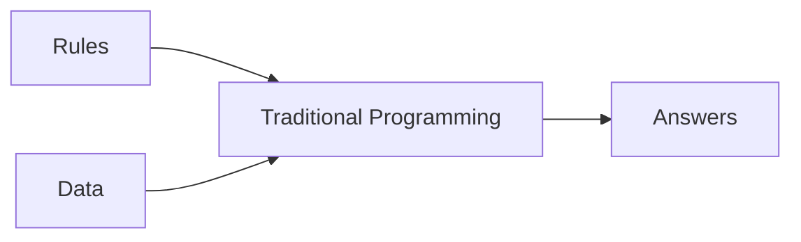
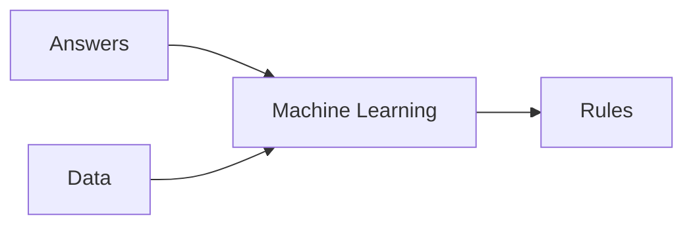

# [Specialization - Tensorflow in Practice](https://www.coursera.org/specializations/tensorflow-in-practice)

# [Course 1 - Intro to Tensorflow](https://www.coursera.org/learn/introduction-tensorflow/home/welcome)

## [Week 1](https://www.coursera.org/learn/introduction-tensorflow/home/week/1)

### Primer

#### Traditional Programming
- rules based programming
- if-then statements


#### Machine Learning
- lots of examples + label
- rules are inferred by ML

### Hello World - Neural Network
[colab](https://github.com/lmoroney/dlaicourse/blob/master/Course%201%20-%20Part%202%20-%20Lesson%202%20-%20Notebook.ipynb)

> X = 
> Y = 
Simple linear curve fitting  

> keras.Sequential()
Define successive layers

> keras.layers.Dense()
Define a layer of connected neurons 
this could be done as a list of Dense() inside Sequential() or Sequential.add(Dense())

> model.compile(optimizer='sgd', loss='mean_squared_error')
define the loss function, and optimizer - to guess the next value (for gradient descent)

> model.fit(epochs=N)
actual training of the model

> model.predict([input])
inference / find predicted values

> model.evaluate(test_images, test_labels)
evaluate the test set


## [Week 2](https://www.coursera.org/learn/introduction-tensorflow/home/week/2)

[colab](https://github.com/lmoroney/dlaicourse/blob/master/Course%201%20-%20Part%204%20-%20Lesson%202%20-%20Notebook.ipynb)

### Intro to Computer Vision
- Help computers look at the images (and understand the content)
- [Fashion MNIST](https://github.com/zalandoresearch/fashion-mnist) -  78k images, 10 categories, 28x28 pixels each
- keras has in-build [datasets] (https://www.tensorflow.org/api_docs/python/tf/keras/datasets) including fashion MNIST

> fashion_mnist = keras.datasets.fashion_mnist
> (train_images, train_labels), (test_images, test_labels) = fashion_mnist.load_data()

- separated training and test data
- labels are enum (numbers) instead of strings - to reduce language [bias](https://developers.google.com/machine-learning/fairness-overview/)

### Coding a CV Neural Network
> keras.layers.Flatten(input_shape=(28, 28))
Takes the input as a linear array

> keras.layers.Dense(128, activation=tf.nn.relu)
Hidden Layer

 > keras.layers.Dense(128, activation=tf.nn.softmax)
> Output layer

### Callback to terminate the training
```
class myCallback(keras.callbacks.Callback):
def on_epoch_end(self, epoch, logs={}):
    if logs.get('accuracy') > DESIRED_ACCURACY:
    print(f"\nReached {DESIRED_ACCURACY}% accuracy so cancelling training!")
        self.model.stop_training = True

callbacks = myCallback()
model.fit(..., callbacks=[callbacks])
```
### Colab Exporations
> Simple NN (28x28 Flatten, 128 relu, 10 softmax) - no CNN

[Ex 1](https://colab.research.google.com/github/lmoroney/dlaicourse/blob/master/Course%201%20-%20Part%204%20-%20Lesson%202%20-%20Notebook.ipynb#scrollTo=rquQqIx4AaGR) - What are the numbers?
A - It is the probability that each item is one of the 10 class (and using softmax, we choose the highest probability)

[Ex 2](https://colab.research.google.com/github/lmoroney/dlaicourse/blob/master/Course%201%20-%20Part%204%20-%20Lesson%202%20-%20Notebook.ipynb#scrollTo=OgQSIfDSOWv6) Impact of larger neurons in the hidden layer(512)?
A - More neurons = slower (and more accurate) training; till an extend.

[Ex 5](https://colab.research.google.com/github/lmoroney/dlaicourse/blob/master/Course%201%20-%20Part%204%20-%20Lesson%202%20-%20Notebook.ipynb#scrollTo=-0lF5MuvSuZF) What is the affect of adding additional hidden layer?
A - Usually more helpful but in this particular case, adding an additional layer reduced the accuracy.

## [Week 3](https://www.coursera.org/learn/introduction-tensorflow/home/week/3)

[colab](https://colab.sandbox.google.com/github/lmoroney/dlaicourse/blob/master/Course%201%20-%20Part%206%20-%20Lesson%202%20-%20Notebook.ipynb)

### CNN - Convolutions and Pooling
- Convolutions are like filters to extract features from images
- Pooling is compressing the result of convolution while reducing the image dimension

> training_images=training_images.reshape(60000, 28, 28, 1)
reshape the input

> tf.keras.layers.Conv2D(num_conv, (3, 3), activation='relu', input_shape=(28, 28, 1))
> tk.keras.layers.MaxPooling2D(2, 2)
Stack the Conv2D and MaxPooling2D before the regular NN layers.

> model.summary()
Shows the NN
the size of image is smaller in the layers because of conv-layers window

[Examples of filters](https://lodev.org/cgtutor/filtering.html)

 ### Colab Exporations
> CNN = Conv(64 x (3,3)), MP(2,2), Conv(64 x (3,3)), MP(2,2),  Flatten, Dense(128) + relu, Dense(10) + softmax
Ex 1 - More training might lead to smaller loss with training set but not with validation set (overfitting).

## [Week 4](https://www.coursera.org/learn/introduction-tensorflow/home/week/4)

### Colabs
- [No Validation](https://github.com/lmoroney/dlaicourse/blob/master/Course%201%20-%20Part%208%20-%20Lesson%202%20-%20Notebook.ipynb)
- [With Validation](https://github.com/lmoroney/dlaicourse/blob/master/Course%201%20-%20Part%208%20-%20Lesson%203%20-%20Notebook.ipynb)
- [Reduced complexity](https://github.com/lmoroney/dlaicourse/blob/master/Course%201%20-%20Part%208%20-%20Lesson%204%20-%20Notebook.ipynb)

### Non-uniform/complex images
- different location of subject in the image
- much cleaner data

### ImageGenerator in TF
- Uses the directory structure to pick up labels
- images need to be of same size (for the TF code) 
- resized when they are loaded (done by ImageGenerator)

### ConvNet params
- 5 layers of CNN 16 -> 32 -> 64 ->64 -> 64
- 3 channels in inputs (RGB)
- Output is single-neuron with sigmoid
	- could have used 2 neurons with softmax
- batch_size : to handle multiple input images together
- steps_per_epoch : number of steps to train in an epoch
	- save value is num_images / batch_size so that every image is processed once in the epoch

### ConvNet Code

- binary_crossentropy because we are using a binary classifier
- RMSProp to specify learning rate
```
from tensorflow.keras.optimizers import RMSprop
model.compile(loss='binary_crossentropy',
              optimizer=RMSprop(lr=0.001),
              metrics=['accuracy'])
```

```
# All images will be resized to 150x150
train_datagen = ImageDataGenerator(rescale=1/255)
train_generator = train_datagen.flow_from_directory('/tmp/horse-or-human/', 
target_size=(300, 300), 
batch_size=128, 
class_mode='binary')
```

```
model.fit(train_generator, 
steps_per_epoch=8,
epochs=15,
validation_data=validation_generator,
validation_steps=8,
verbose=2)
```

###  Speed up (at cost of accuracy)
- by reducing image size
- changing number of CNN layers

# [Course 2 - CNN in Tensorflow](https://www.coursera.org/learn/convolutional-neural-networks-tensorflow)

## [Week 1](https://www.coursera.org/learn/convolutional-neural-networks-tensorflow/home/week/1)


### Data is coming from real-world
- less cleaner
- the previous structure works well

```
history = model.fit()
acc = history.history[ 'accuracy' ]
val_acc = history.history[ 'val_accuracy' ]
loss = history.history[ 'loss' ]
val_loss = history.history['val_loss' ]
```

## [Week 2 - Image Augmentation](https://www.coursera.org/learn/convolutional-neural-networks-tensorflow/home/week/2)

### Data Augmentation
- No additional storage, all transformation are in memory while reading the data
- Reduce overfitting

```
train_datagen = ImageDataGenerator(      
	rotation_range=40,      
	width_shift_range=0.2,      
	height_shift_range=0.2,      
	shear_range=0.2,      
	zoom_range=0.2,      
	horizontal_flip=True,      
	fill_mode='nearest')
```

From [Tensorboard in notebook](https://www.tensorflow.org/tensorboard/tensorboard_in_notebooks)
```
%load_ext tensorboard
import datetime
logdir = os.path.join("logs", datetime.datetime.now().strftime("%Y%m%d-%H%M%S"))
tensorboard_callback = tf.keras.callbacks.TensorBoard(logdir, histogram_freq=1)
%tensorboard --logdir logs

model.fit(..., callbacks=[tensorboard_callback])
```

### Do we need to augment validation data?

[https://www.kaggle.com/c/dogs-vs-cats/overview](https://www.kaggle.com/c/dogs-vs-cats/overview)

## [Week 3 - Transfer Learning](https://www.coursera.org/learn/convolutional-neural-networks-tensorflow/home/week/3)

### Transfer Learning
- Take an existing (trained) model and keep the weights of the top layers fixed(towards CNN) fixed
- Enable the lower layers to change
- Plug the model in a new model with required output (classification, prediction etc)
- Train on new data

[Code example](https://github.com/PracticalDL/Practical-Deep-Learning-Book/blob/master/code/chapter-3/1-keras-custom-classifier-with-transfer-learning.ipynb) from PracticalDL book

```
from tensorflow.keras.applications.inception_v3 import InceptionV3

local_weights_file = '/tmp/inception_v3_weights_tf_dim_ordering_tf_kernels_notop.h5'
pre_trained_model = InceptionV3(input_shape = (150, 150, 3), include_top = False, weights = None)
pre_trained_model.load_weights(local_weights_file)

for layer in pre_trained_model.layers:
	layer.trainable = False

pre_trained_model.summary()

last_layer = pre_trained_model.get_layer('mixed7')
print('last layer output shape: ', last_layer.output_shape)
last_output = last_layer.output
```

### Training for transfer learning

```
# Flatten the output layer to 1 dimension
x = layers.Flatten()(last_output)

# Add a fully connected layer with 1,024 hidden units and ReLU activation
x = layers.Dense(1024, activation='relu')(x)

# Add a dropout rate of 0.2
x = layers.Dropout(0.2)(x)

# Add a final sigmoid layer for classification
x = layers.Dense(1, activation='sigmoid')(x)

model = Model(pre_trained_model.input, x)
```

### Dropout
[https://www.tensorflow.org/api_docs/python/tf/keras/layers/Dropout](https://www.tensorflow.org/api_docs/python/tf/keras/layers/Dropout)
- Regularization feature
- Use for overfitting - mostly for CNN
- Cost function (J) is harder to define

## [Week 4 - Multiclass Classification](https://www.coursera.org/learn/convolutional-neural-networks-tensorflow/home/week/4)


| Code  	| Binary  	| Multiclass  	|
|---	|---	|---	|
train_generator|flow_from_directory(... , class_mode='binary') | flow_from_directory(... , class_mode='categorical')  
|  final layer 	| keras.layers.Dense(1, activation='sigmoid') | keras.layers.Dense(N, activation='softmax')  	| 
|   	|   	|   	|   	|

<!--stackedit_data:
eyJoaXN0b3J5IjpbLTc4ODEwMDYwOSwtMTI1NzQzNDE1OSwtMT
g2NDQ2OTE4MiwtMTgwODEwMzkzMCw3NjA0NjE5NzcsLTIxMjYz
MDcyNjUsMTU4NzcwMzkyMiwzNjU0MjQyNzMsLTgyOTUxNjI3NC
w0MjAwNzU4MzEsLTEzOTE4Njc5NTgsLTEzMjI1ODYyMDUsNDg0
NjExNTk2LDIxMDc4NzgzOTgsMTE2MDc1NDc1NiwtMTc5MDUyND
I0MSw5NTg4NjkzNSwxMTI4NzQ2NzQsMTg5NTUyMzMzMCw2Njg3
NDI4OTRdfQ==
-->