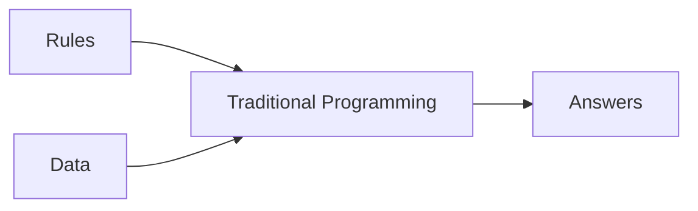
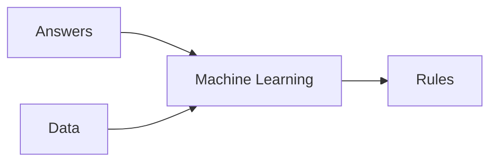

# [Course 1 - Intro to Tensorflow](https://www.coursera.org/learn/introduction-tensorflow/home/welcome)

## [Week 1](https://www.coursera.org/learn/introduction-tensorflow/home/week/1)

### Primer

#### Traditional Programming
- rules based programming
- if-then statements

#### Machine Learning
- lots of examples + label
- rules are inferred by ML

### Hello World on Neural Network
> X = 
> Y = 
<!--stackedit_data:
eyJoaXN0b3J5IjpbMTgwMDQ1MjY4NywtMTExNDY4NTQwNywtOT
A1NTQ4ODI3LDczMDk5ODExNl19
-->