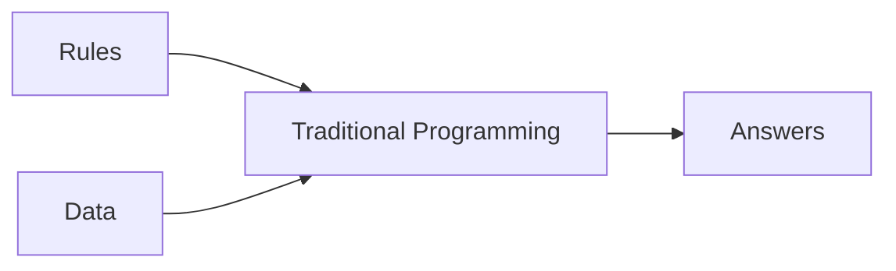
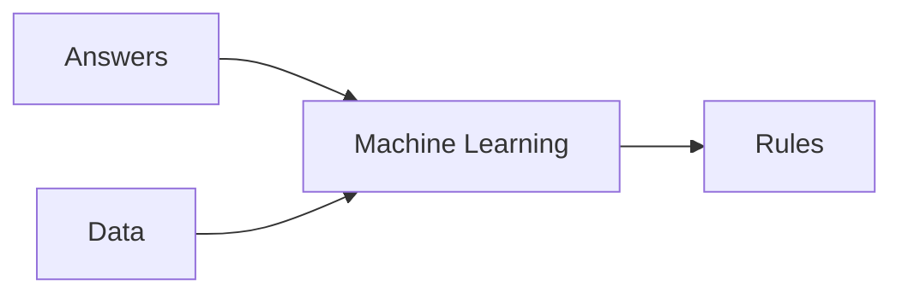

# [Course 1 - Intro to Tensorflow](https://www.coursera.org/learn/introduction-tensorflow/home/welcome)

## [Week 1](https://www.coursera.org/learn/introduction-tensorflow/home/week/1)

### Primer

#### Traditional Programming

### Hello World in TF
> hello
<!--stackedit_data:
eyJoaXN0b3J5IjpbLTExMTQ2ODU0MDcsLTkwNTU0ODgyNyw3Mz
A5OTgxMTZdfQ==
-->